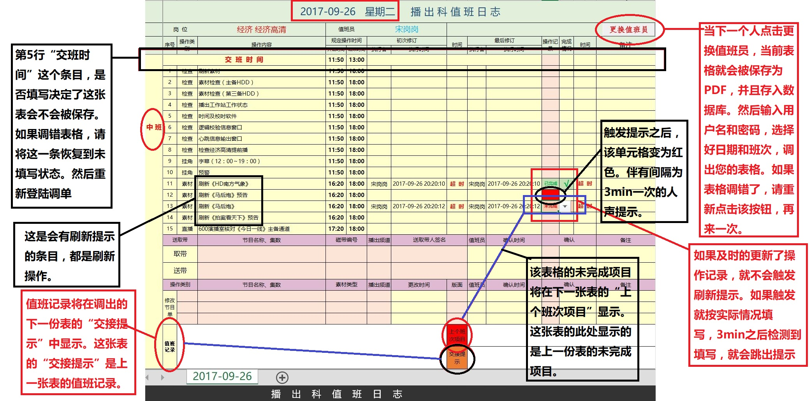

# 新版日志管理的几点说明

## 使用

- 新版本沿用了旧版本的登陆和使用方法。只是对结构做了调整。

- 每一个班次对应一张表格，对节目单修改的记录也添加在了这张表格里。

- 表格不会被保存为EXCEL工作表，会以PDF文件的形式保存，同时会在数据库里作记录。

- 表格对一些刷新的条目会在合适的时间进行提醒。

## 注意

- **刷新提示每3分钟检测一次工作表的状态。因此对于该单元格操作之后，需要等待3分钟后方可进行切换用户的操作，否则下次登陆可能会报错。如果报错，即使成功登陆并生成了表格，请关闭EXCEL，再打开重新登陆。并没有找到很合适的方法来解决这个问题。如果有建议，请告知。如下图：**
  
>
>
- **每个表格的第五行，如下图。是检测该表是否为空的依据，如果被认为是空表就不会被保存。所以如果表格没有问题，这一单元格是必填的。如果生成了错误表格，只要该单元格为空，重新登陆即可生成表新，这样错误的表格也不会被保存。如下图：**
  
>
>
- **如果是通宵班请注意日期，日历控件不是系统控件，是自个写的，所以可能存在疏漏，如果发现请告知。如下图：**
  
>
>
- **刷新提示的时间设置不一定合理，请在使用的过程中提出建议。如果是周末有些条目无需刷新，点击未完成即可。**
>
>
- **为防止误关闭工作簿导致表格不能被保存，因此该工作簿不能通过点击关闭按钮关闭。需要点击“更换值班员”，然后在登陆窗口中点击“取消”关闭。如下图：**
  

##图示

